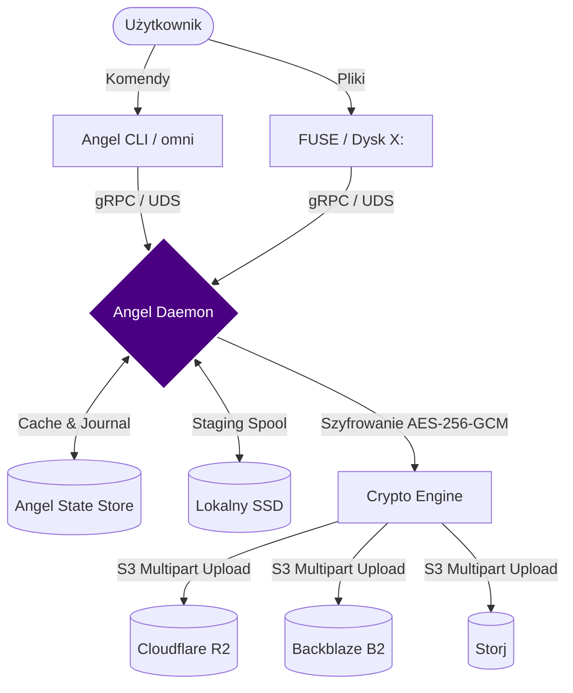

# 🚀 OmniDrive VFS

**OmniDrive VFS** to bezpieczny wirtualny system plików i silnik repozytorium, który agreguje wiele backendów chmurowych (S3) w jedną, logiczną i zaszyfrowaną przestrzeń dyskową. 

Nie jest to klasyczny RAID. To **zaszyfrowane, adresowane zawartością repozytorium (Content-Addressed) z semantyką montowanego systemu plików (VFS)**.

## 🏗️ Architektura Systemu (Angel-First)

Projekt opiera się na architekturze rozdzielonych procesów. Sercem systemu jest niewidzialny **Angel (`angeld`)**, zarządzający stanem i kryptografią, podczas gdy klienci (CLI/FUSE) pełnią rolę lekkich interfejsów.

## Architektura sieci: 100% Local-First

`angeld` nasłuchuje **wyłącznie** na loopback (`127.0.0.1:8787`) lub opcjonalnie w sieci LAN — nigdy na publicznym interfejsie.

| Zasada | Szczegóły |
|---|---|
| **Brak publicznego endpointu** | Daemon nie jest wystawiany przez Cloudflare Tunnel ani żaden inny reverse proxy na zewnątrz sieci LAN. |
| **OAuth redirect — tylko loopback** | `OAUTH_REDIRECT_URL` musi zaczynać się od `http://127.0.0.1:` lub `http://localhost:` (RFC 8252). Release build odrzuca każdą inną wartość. |
| **CORS — loopback + LAN** | `share_cors_layer()` zezwala wyłącznie na origins z `127.0.0.1`, `localhost`, `192.168.*`, `10.*`, `172.16-31.*`. Domena `skarbiec.app` i inne publiczne domeny są **explicite wykluczone**. |
| **`skarbiec.app` = static content only** | Domena hostuje wyłącznie statyczne zasoby na GitHub Pages: dekryptor share-linków (Tryb B Epic 33) i landing page. **Żaden proces serwerowy z dostępem do danych użytkownika nie uruchamia się pod tą domeną.** |
| **Zero-Knowledge** | W Trybie B (Public Share) przeglądarka odbiorcy pobiera zaszyfrowane chunki bezpośrednio z B2/R2 — daemon Alice może być offline przez cały czas pobierania. DEK w URL `#fragment` nigdy nie trafia do serwera HTTP. |

Aplikacja działa w 100% bez domeny `skarbiec.app` — domena to wyłącznie kanał dystrybucji linków do udostępnionych plików i landing page.